# Social Network API

### Description
_____________________________
Social networks are extremely common for people to use as a form of communication and broadcasting.  This project sets up the basic backend structure of a social network by utilizing the idea of users, friends, thoughts and reactions.

This project does not have a front end and must be tested through a program like Insomnia for route testing.

This project was developed using node, mongoose, moment, express and Insomnia for testing.

### Table of Contents
_____________________________
* [Installation](#installation)
* [Usage](#usage)
* [Tests](#tests)
* [Questions](#questions)

### Installation
_____________________________
*Steps required to intall and run this program:*

Once the code is cloned from the repository, you must run `npm install` in your terminal in the root directory.

The program itself can be called and used by typing the command `npm start`.

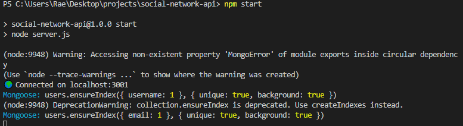

### Usage
_____________________________
*Instructions and example for use:*

Please view the videos below for a full walk through of the functionality!
* [User Route Walk Through in Insomnia](https://drive.google.com/file/d/1B3-YKGuEd-AVkNB4U2d6HwLls84e2qu5/view)
* [Thought Route Walk Through in Insomnia](https://drive.google.com/file/d/1041O6gma1WxWovc-URKBVU36b05_R7ZS/view)

When the user starts the server, `localhost:3001` becomes live and is available for testing.  See below for screenshots from Insomnia:

### User Routes
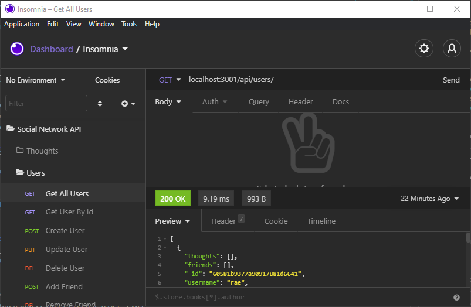

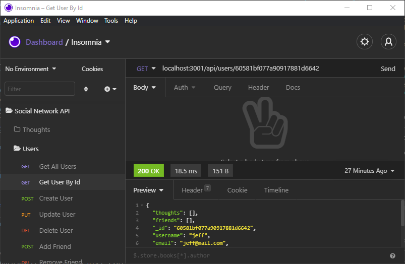

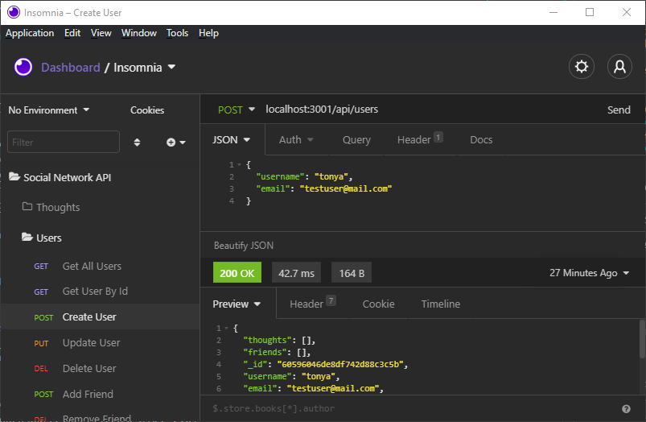

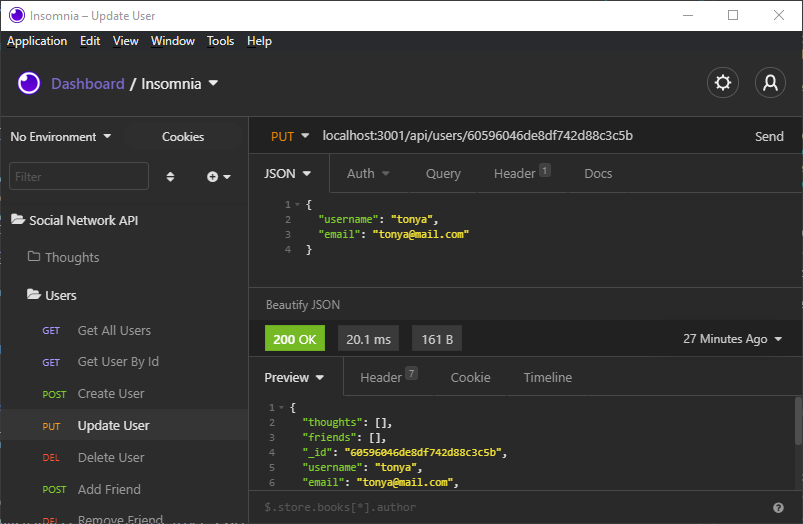

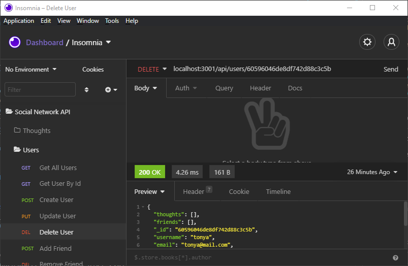

### Friends
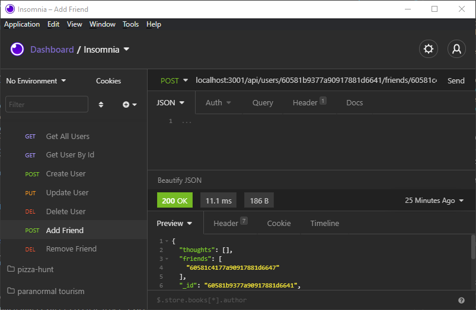

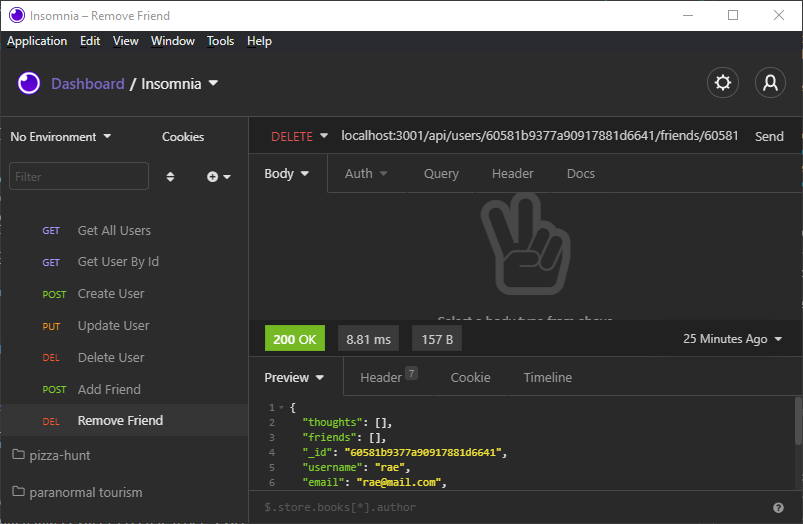

### Thought Routes
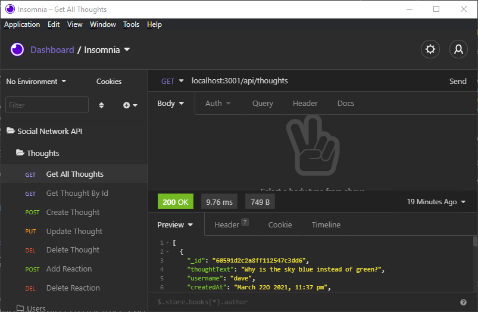

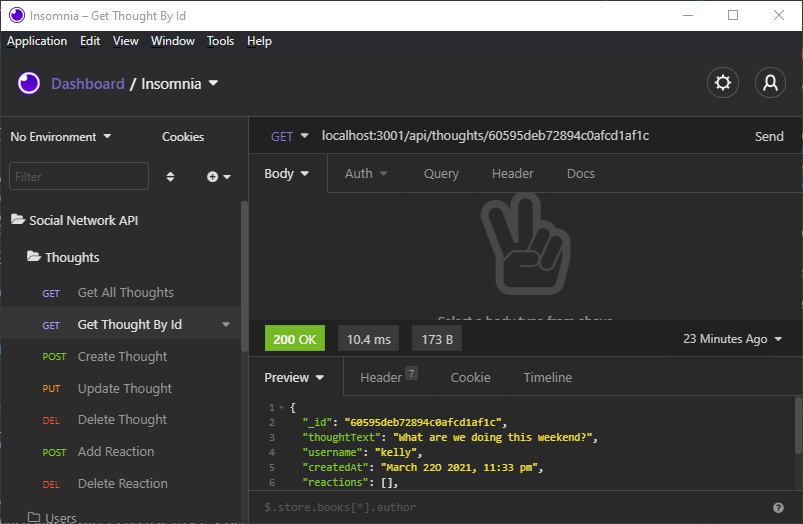

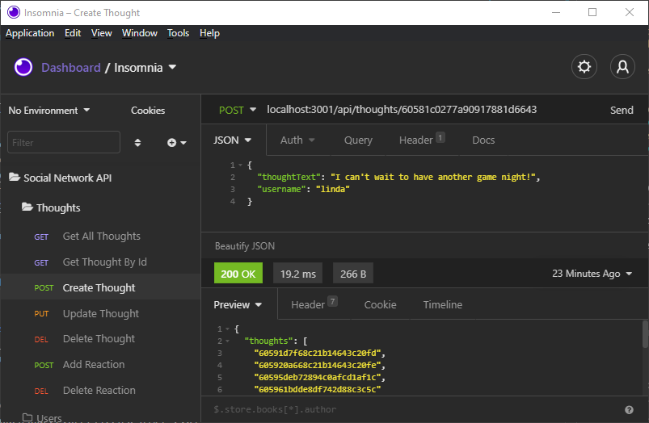

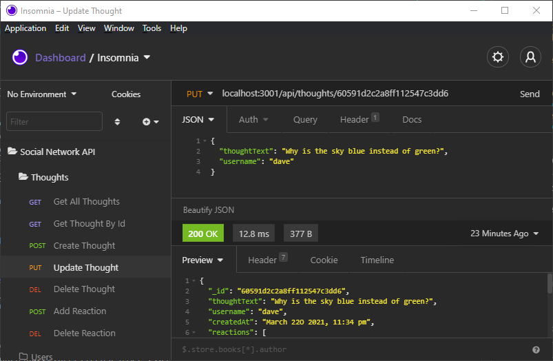

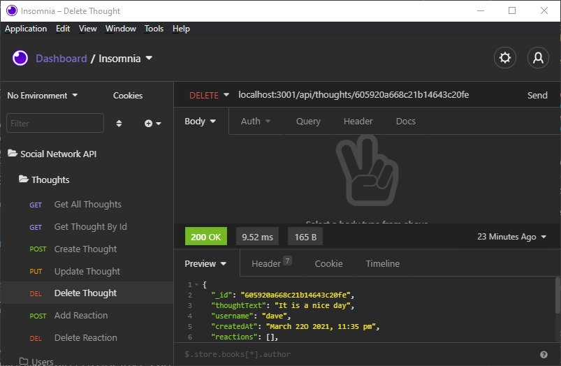

### Reactions
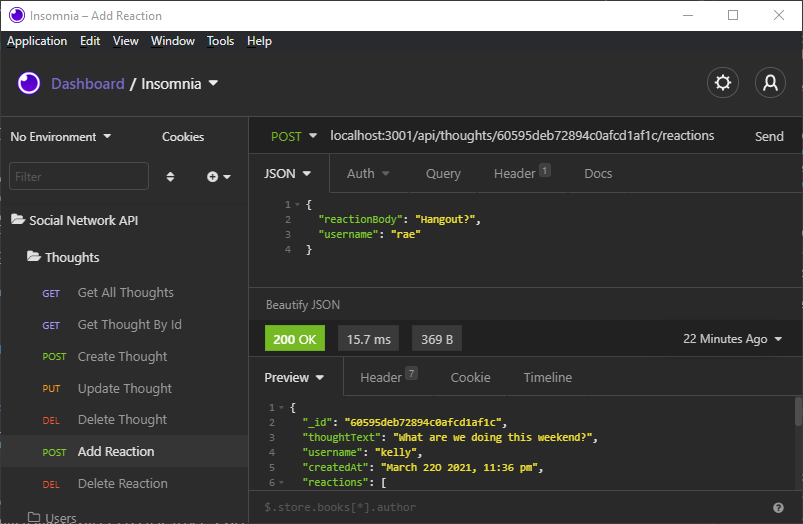

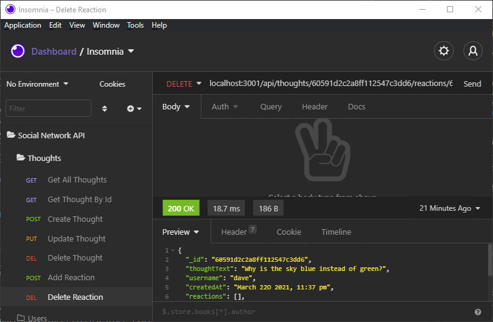

### Tests
_____________________________
All testing is done in Insomnia.

### Questions
_____________________________

  Please click on the link provided to access the author's [Github](http://github.com/RaeStichter).
  

  Further questions can be directed the the author's email address: rae@mail.com.
  